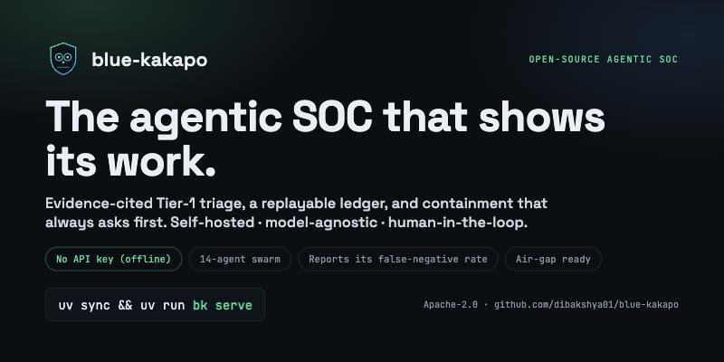
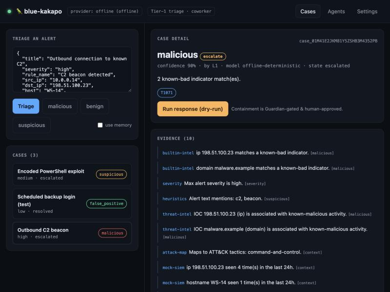

<div align="center">



# 🦜 blue-kakapo

**An open-source, self-hostable, agentic SOC platform for trustworthy Tier-1 triage.**
*A transparent coworker for L2/L3 analysts — not a black box that acts alone.*

[](LICENSE)
[](pyproject.toml)
[](build-plan.md)
[](#quickstart)
[](docs/providers.md)
[](docs/eval.md)
[](CONTRIBUTING.md)

[**Website**](https://dibakshya01.github.io/blue-kakapo/) · [Docs](docs/index.md) · [Plain-English overview](docs/what-it-can-and-cannot-do.md) · [Architecture](docs/architecture.md)

</div>

> **Status:** early, active development. The architecture and staged plan are in
> [`build-plan.md`](build-plan.md); the research behind it is in [`finding.md`](finding.md).

---

## The pitch, in six lines

| | |
|---|---|
| **Problem** | SOCs drown in alerts; most go uninvestigated; the scariest miss is a real threat hidden in the noise. |
| **Idea** | A swarm of specialized agents does the Tier-1 first pass — fast **and** transparent. |
| **What's inside** | 14 agents + orchestrator · Guardian safety gate · replayable crypto-shred ledger · opt-in memory · model-agnostic gateway. |
| **How it works** | Deterministic spine, bounded LLM reasoning, every action gated and recorded. |
| **Proof** | 150+ tests, an adversarial suite, and an eval harness that reports the **false-negative rate** — no unaudited numbers. |
| **Get started** | `uv sync && uv run bk serve` — offline, no API key, data stays local. |

<div align="center"></div>

---

## Why

SOC teams drown in alerts — commonly **3,000–4,500 a day**, of which **40–63% are never
investigated** and **~42–46% are false positives**. Analysts burn out (≈71%) and the cost of being
slow is real (sub-200-day breach containment saves ~$1.9M). Tier-1 triage is the agreed first thing
to automate — but every capable AI-SOC product today is **closed, cloud-only SaaS** that ships your
security telemetry to a vendor, on opaque consumption pricing, with black-box reasoning you're asked
to trust. (Sources in [`finding.md`](finding.md).)

**blue-kakapo is the open alternative:** a swarm of specialized agents coordinated by a deterministic
orchestrator that triages alerts fast **and** shows its work — runs entirely in your network, on any
LLM (cloud or local), with every decision gated by a Guardian and recorded in a replayable,
tamper-evident case ledger.

## What makes it different

- **Trust is the product.** Every verdict is evidence-cited and replayable from a **tamper-evident**
  (hash-chained, append-only) case ledger. We ship an **evaluation harness that reports the
  false-negative rate** instead of a marketing accuracy number.
- **Deterministic spine, bounded intelligence.** A typed, checkpointed state machine drives the flow;
  LLMs are confined to scoped reasoning tasks after deterministic enrichment. Controls hallucination
  and cost.
- **Human-in-the-loop by default.** Any containment action is **Guardian-gated** (allow/deny/modify/
  ask/defer, default *ask*), blast-radius-limited, reversible, and audited.
- **In-network & model-agnostic.** Localhost or air-gapped K8s. Anthropic / OpenAI / Azure / local
  **Ollama** — switchable anytime — plus a **deterministic offline mode that needs no API key**.
- **Integration-first.** A capability-declaring connector SDK + reference connectors, MCP-native,
  OCSF-normalized.

## Quickstart

> Requires Python 3.11+. The fastest path is [`uv`](https://docs.astral.sh/uv/).

```bash
git clone https://github.com/dibakshya01/blue-kakapo.git
cd blue-kakapo
uv sync                 # install
uv run bk info          # show resolved config (offline by default — no key needed)
uv run bk serve         # start the control-plane API on http://127.0.0.1:8713
uv run bk triage -      # triage one alert from stdin (JSON)
uv run bk eval          # run the eval harness — reports the false-negative rate, honestly
```

Open `http://127.0.0.1:8713/healthz` — you're running, in **offline mode**, with no credentials and
no data leaving your machine. Point it at a real LLM provider (or a local Ollama) when you're ready.

Full Docker Compose and Kubernetes (Helm) deployment land in later stages — see the roadmap.

## Architecture (one breath)

Connectors → OCSF normalization → a deterministic **orchestration kernel** drives each **Case** →
specialist agents reason (bounded LLM, deterministic-first) → the **Guardian** gates every
state-changing action → everything is recorded in a hash-chained, replayable **case ledger** →
surfaced in a **coworker dashboard**. Model-agnostic provider gateway; opt-in case memory. See
[`build-plan.md`](build-plan.md) §4 for the full design and the 14-agent roster.

## Honest limits

blue-kakapo reasons over the telemetry and detections you feed it — it does not replace good
detection engineering, and alert reduction is not the same as better detection. Local models trail
frontier models on hard cases. Guardrails reduce, not eliminate, prompt-injection risk. False
negatives remain possible, which is why humans stay in the loop and we ship the measuring tool rather
than a number. See [`build-plan.md`](build-plan.md) §8.

## Documentation

Full docs in [`docs/`](docs/index.md): [getting started](docs/getting-started.md),
[architecture](docs/architecture.md), [the 14 agents](docs/agents.md),
[connectors](docs/connectors.md), [LLM providers](docs/providers.md), [memory](docs/memory.md),
[the Guardian](docs/guardian.md), [evaluation](docs/eval.md), the
[security model + AISVS self-assessment](docs/security-model.md), the
[threat model](docs/threat-model.md), [GDPR/erasure](docs/gdpr-erasure.md), and — importantly —
[what it can & cannot do](docs/what-it-can-and-cannot-do.md).

## Contributing & security

See [`CONTRIBUTING.md`](CONTRIBUTING.md) and [`SECURITY.md`](SECURITY.md). Licensed under
[Apache-2.0](LICENSE).
